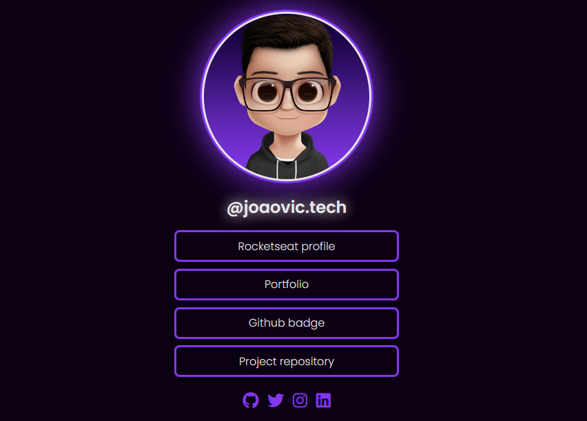

# Social Tree Challenge 
Page in HTML and CSS with links to social networks. Rocketseat Discover Challenge.
 
💻 Project:

<div align="center">



</div>

This challenge consists of creating a social tree, to train all the knowledge acquired in the courses **Rocketseat Discover**.

I implemented using `github API`

The project uses the `github api` to render my github profile picture.
code example:

```js
//                                          user-name
const url = 'https://api.github.com/users/joaovic-tech'
const img = document.getElementById('my-icon');

async function getDataGithub() {
  try {
    const response = await fetch(url);
    const resBody = await response.json();

    img.src = resBody.avatar_url;
  } catch { err => console.log(err) }
}

getDataGithub();
```

<hr>

🚀 Technologies used:

* HTML
* CSS
* JS
* FontAwesome

<hr>

📃 Licence:
* [Mit License](./License) 

<hr>

Made with 💜 by [João Victor 👨‍💻](https://github.com/joaovic-tech)
